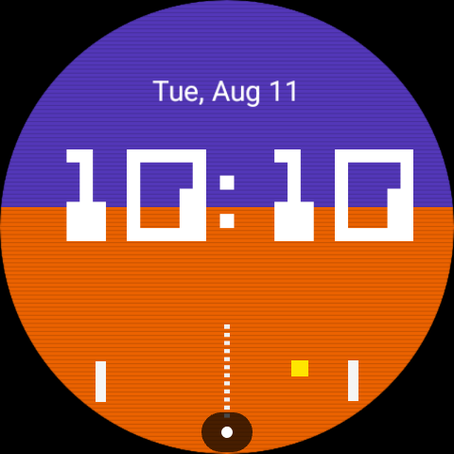
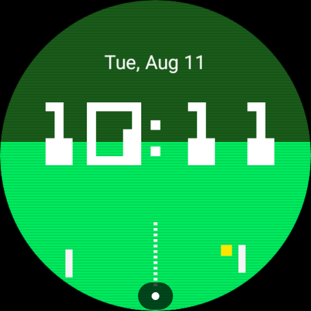
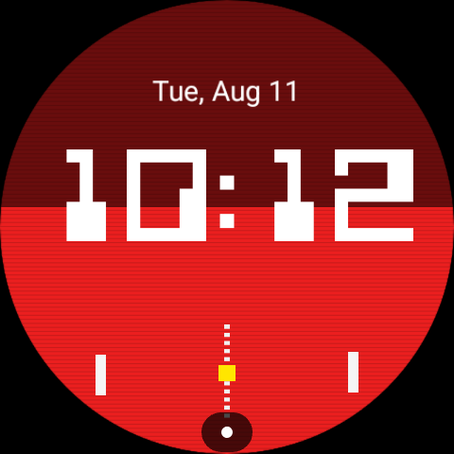
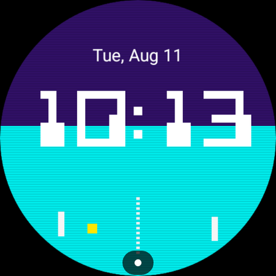
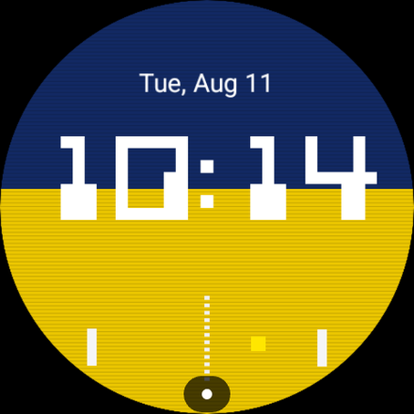

# Pong Watch Face

A Wear OS watch face built entirely with the [Watch Face Format](https://developer.android.com/training/wearables/wff) (declarative XML, no code) — a retro arcade time display over a two-tone split background, with a tiny game of Pong playing out underneath.



## Features

- **Retro digit font** — a blocky pixel-grid font (0-9 and colon) transcribed from a classic Atari-style reference, always rendered in fixed white for contrast against any theme
- **15 selectable color themes** — the original purple/orange look plus 14 more, each a two-tone split background you can pick from the watch face's on-device Edit menu (long-press the face, tap Edit)
- **Day and date** — shown at the top (e.g. "Mon, Aug 10")
- **A living game of Pong** — two paddles and a ball bounce around a dashed center court in the lower half of the face; the paddles move independently, and the ball's motion is smoothed rather than jumping once a second
- **Ambient mode** — the face stays fully visible and simply dims when the watch goes ambient, with the Pong game frozen in place until you wake the screen again
- **Faint CRT scanline overlay** for a bit of arcade-cabinet texture

Every pixel-art asset is generated from scratch by [`watchface/scripts/generate_pixel_assets.py`](watchface/scripts/generate_pixel_assets.py) — nothing is traced or copied from any existing game.

### Color themes

| Classic Arcade (default) | Night Vision | Crimson Sky |
|:---:|:---:|:---:|
|  |  |  |

| Cosmic Cyan | Golden Marsh |
|:---:|:---:|
|  |  |

...plus 10 more (War Room, Radar Yellow, Neon Magenta, Copper Cyan, Jungle Vine, Emerald Grid, Molten Amber, Venom Pink, Desert Amber, Signal Green) — pick your favorite from the watch face's Edit menu.

## Project structure

```
watchface/
├── scripts/
│   └── generate_pixel_assets.py   # generates all the pixel-art PNGs used below
└── src/main/
    ├── res/raw/watchface.xml      # the watch face definition (Watch Face Format XML)
    ├── res/drawable/              # generated pixel-art assets
    └── AndroidManifest.xml
```

## Building

This module is a declarative Watch Face Format watch face (`hasCode = false` — no Kotlin/Java code), so there's nothing to compile beyond packaging the XML and resources.

Regenerate the pixel-art assets after changing any colors/sizes in the generator script:

```bash
python3 watchface/scripts/generate_pixel_assets.py
```

Build and install on a connected Wear OS device or emulator:

```bash
./gradlew :watchface:assembleDebug
adb install -r watchface/build/outputs/apk/debug/watchface-debug.apk
```

Then select it from the watch face picker on the device (it may need a device reboot to show up the first time it's installed).

## Requirements

- Wear OS 6 / API 36 (`minSdk 36`)
- A device or emulator running the Watch Face Format runtime

## License

Apache License 2.0 — see [LICENSE](LICENSE).
